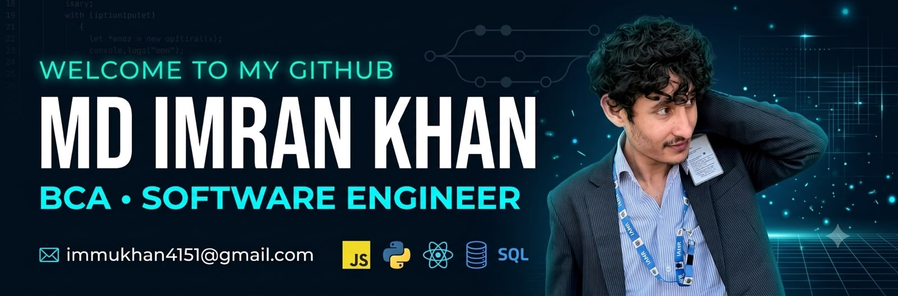

  

<h1 align="center">Hi 👋, I'm Md Imran Khan</h1>

<h3 align="center">
BCA Student • Aspiring Software Developer • Web Development Learner • Open to Internship Opportunities
</h3>

  

---

# 👨‍💻 About Me

🎓 Bachelor of Computer Applications (BCA) Student

💻 Passionate About Software Development & Web Development

🚀 Currently Building Real-World Projects

🌱 Currently Learning:

- HTML
- CSS
- JavaScript
- React
- Java
- Python
- Git & GitHub

💼 Looking For:

- Software Development Internship
- Web Development Internship
- IT Internship

📫 Email:
**immukhan4151@gmail.com**

📍 Location:
Delhi / Bihar, India

⚡ Fun Fact:
**I love learning new technologies and turning ideas into real projects.**

---

# 🌐 My Portfolio

---

# 🚀 Technical Skills

### Programming Languages

- C
- C++
- Java
- Python
- JavaScript

### Frontend Development

- HTML5
- CSS3
- JavaScript
- Responsive Design

### Database

- MySQL

### Tools & Platforms

- Git
- GitHub
- VS Code

---

# 🛠️ Languages & Tools

---

# 📂 Featured Projects

## 🌟 Personal Portfolio Website

Responsive portfolio website built using HTML, CSS and JavaScript.

🔗 Live Demo:
https://mdimrankhan-ai.github.io/portfolio-/

---

## 🌟 Student Management System

Java + JDBC + MySQL CRUD Project

Features:

- Add Student
- Search Student
- Update Student
- Delete Student

---

## 🌟 Oasis Infobyte Internship Projects

- Landing Page
- Portfolio Website
- Temperature Converter
- Upcoming Projects

---

# 🎯 Current Goals

✅ Master HTML, CSS & JavaScript

✅ Learn React.js

✅ Learn Backend Development

✅ Build 10+ Real World Projects

✅ Contribute to Open Source

✅ Get a Software Development Internship

✅ Become a Full Stack Developer

---

# 🤝 Connect With Me

&nbsp;&nbsp;

&nbsp;&nbsp;

---

# 💡 Quote

"Success doesn't come from what you do occasionally. It comes from what you do consistently."

---

<h3 align="center">

⭐ Thanks For Visiting My Profile ⭐

</h3>

🚀 Keep Learning • Keep Building • Keep Growing 🚀

